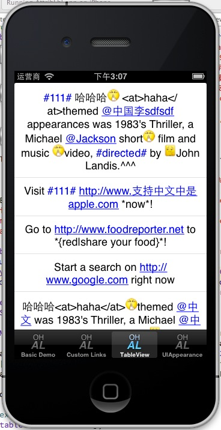

# About these classes

### 修改

因为主要是为了适应个人项目修改，所以很难并入主版本库了。
修改如下:

1. 加入表情支持

1. 加入中文链接支持

1.  通过[CocoaPods](https://github.com/CocoaPods/CocoaPods)进行安装
    
```pod 'OHAttributedLabel', :git => 'https://github.com/hhuai/OHAttributedLabel.git'```


### ScreenShot



### OHAttributedLabel

This class allows you to use a `UILabel` with `NSAttributedString`s, in order to **display styled text** with mixed style (mixed fonts, color, size, ...) in a unique label. It is a subclass of `UILabel`, which adds an `attributedText` property. Use this property, instead of the `text` property, to set and get the `NSAttributedString` to display.

This class **also support hyperlinks and URLs**. It can **automatically detect links** in your text, color them and make them touchable; you can also **add "custom links" in your text** by attaching an URL to a range of your text and thus make it touchable, and even then catch the event of a touch on a link to act as you wish to.

### NSAttributedString and NSTextChecking additions

In addition to this `OHAttributedLabel` class, you will also find a category of `NS(Mutable)AttributedString` to ease creation and manipulation of common attributes of `NSAttributedString` (to easily change the font, style, color, ... of a range of the string). See the header file `NSAttributedString+Attributes.h` for a list of those comodity methods.

There is also a category for `NSTextCheckingResult` that adds the `extendedURL` property. This property returns the same value as the `URL` value for standard link cases, and return a formatted Maps URL for `NSTextCheckingTypeAddress` link types, that will open Google Maps in iOS version before 6.0 and the Apple's Maps application in iOS 6.0 and later.

### OHASMarkupParsers and simple markup to build your attributed strings easily

The library also comes with very simple tag parsers to help you build `NSAttributedStrings` easily using very simple tags.

* the class `OHASBasicHTMLParser` can parse simple HTML tags like `<b>` and `<u>` to make bold and underlined text, change the font color using `<font color='…'>`, etc
* the class `OHASBasicMarkupParser` can parse simple markup like `*bold text*`, `_underlined text_` and change the font color using markup like `{red|some red text}` or `{#ff6600|Yeah}`.

        // Example 1: parse HTML in attributed string
        basicMarkupLabel.attributedText = [OHASBasicHTMLParser attributedStringByProcessingMarkupInAttributedString:basicMarkupLabel.attributedText];
    
        // Example 2: parse basic markup in string
        NSAttributedString* as = [OHASBasicMarkupParser attributedStringByProcessingMarkupInString:@"Hello *you*!"];

        // Example 3: //process markup in-place in a mutable attributed string
        NSMutableAttributedString* mas = [NSMutableAttributedString attributedStringWithString:@"Hello *you*!"];
        [OHASBasicMarkupParser processMarkupInAttributedString:mas];

_Note that `OHASBasicHTMLParser` is intended to be a very simple tool only to help you build attributed string easier: this is not intended to be a real and complete HTML interpreter, and will never be. For improvements of this feature, like adding other tags or markup languages, refer to [issue #88](http://github.com/AliSoftware/OHAttributedLabel/issues/88))_

### UIAppearance support

The `OHAttributedLabel` class support the `UIAppearance` proxy API (available since iOS5). See selectors and properties marked using the `UI_APPEARANCE_SELECTOR` in the header.

This means that if you are targetting iOS5, you can customize all of your `OHAttributedLabel` links color and underline style to fit your application design, only in one call at the beginning of your application, instead of having to customize these for each instance.

For example, your could implement this in your `application:didFinishLoadingWithOptions:` delegate method to make **all** your `OHAttributedLabel` instances in your **whole app** display links in green and without underline instead of the default underlined blue:

    - (BOOL)application:(UIApplication *)application didFinishLaunchingWithOptions:(NSDictionary *)launchOptions
    {
        [ [OHAttributedLabel appearance] setLinkColor:[UIColor colorWithRed:0.0 green:0.4 blue:0.0 alpha:1.0] ];
        [ [OHAttributedLabel appearance] setLinkUnderlineStyle:kCTUnderlineStyleNone ];
        return YES;
    }

----

# How to use in your project

There are two possible methods to include these classes in your project:

1. Using [Cocoapods](http://cocoapods.org):
    * add `pod "OHAttributedLabel"` to your Podfile

2. Manually:
    * Include the `OHAttributedLabel.xcodeproj` project in your Xcode4 workspace
    * Add the `libOHAttributedLabel.a` library **and the `CoreText.framework`** to your "Link binary with libraries" Build Phase.
    * Add the relative path to the OHAttributedLabel headers in your "User Header Search Path" Build Setting
    * Add the `-ObjC` flag in the "Other Linker Flags" Build Setting if not present already

Then in your application code, when you want to make use of OHAttributedLabel methods, import the headers as usual: `#import "OHAttributedLabel.h"` or `#import "NSAttributedString+Attributes.h"` etc.

For more details and import/linking troubleshooting, please see the [dedicated page](https://github.com/AliSoftware/OHAttributedLabel/wiki/How-to-use) and issue #90.

# Sample code & Other documentation

There is no explicit docset or documentation of the class yet sorry (never had time to write one), but

* The method names should be self-explanatory (hopefully) as I respect the standard ObjC naming conventions.
* There are doxygen/javadoc-like documentation in the headers that should also help you describe the methods
* The provided example ("AttributedLabel Example.xcworkspace") should also demonstrate quite every typical usages — including justifying the text, dynamically changing the style/attributes of a range of text, adding custom links, make special links with a custom behavior (like catching @mention and #hashtags), and customizing the appearance/color of links.

# ChangeLog — Revisions History

The [_ChangeLog_](http://github.com/AliSoftware/OHAttributedLabel/wiki/Revisions-History) is maintained as a [wiki page accessible here](http://github.com/AliSoftware/OHAttributedLabel/wiki/Revisions-History).

# Projects that use this class

Here is a non-exhaustive list of [the projects that use this class](http://github.com/AliSoftware/OHAttributedLabel/wiki/They-use-this-class) (for those who told me about it)
Feel free to contact me if you use this class so we can cross-reference our projects and quote your app in this dedicated wiki page!
